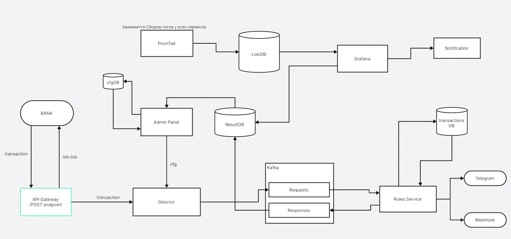

# finrad++

Микросервис для анализа банковских транзакций и выявления мошеннической активности спроектирован для встраивания в высоконагруженные системы. Он расширяем как на уровне микросервисов (посредством кластеризации), так и на уровне отдельных сервисов (с помощью параметров конкурентности).

## Использование
Конфигурирования правил для анализа из админ панели, доступны 4 вида правил: treshold (boolean condiditon), composite (treshold composition), pattern (SqlDB like filters), ml_rule (ml predictions)

## Архитектура



## Быстрый старт

Для запуска проекта необходим установленный Docker и Docker Compose.

1.  **Клонируйте репозиторий**

2.  **Запустите сервисы:**
    Выполните следующую команду из корневой директории проекта:
    ```bash
    docker compose up
    ```

    Эта команда соберёт и запустит все необходимые контейнеры. После завершения запуска API сервис будет доступен.
## Использование API

Сервис предоставляет REST API эндпоинт для отправки транзакций на проверку.


**Эндпоинт:**
- **URL:** `POST /transaction`
- **Content-Type:** `application/json`

**Базовый URL зависит от окружения:**
- Локальная разработка: `http://localhost:8080`
- Продакшен: `https://your-production-domain.com`

**Пример тела запроса:**

```json
{
    "transaction_id": "T100000",
    "timestamp": "2023-08-22T09:22:43.516168",
    "sender_account": "ACC877572",
    "receiver_account": "ACC388389",
    "amount": 343.78,
    "transaction_type": "withdrawal",
    "Merchant_category": "utilities",
    "location": "Tokyo",
    "device_used": "mobile",
    "payment_channel": "card",
    "ip_address": "13.101.214.112",
    "device_hash": "D8536477"
}
```

**Описание полей:**
- `transaction_id` (string): Уникальный идентификатор транзакции.
- `timestamp` (string): Временная метка транзакции в формате ISO 8601.
- `sender_account` (string): Номер счета отправителя.
- `receiver_account` (string): Номер счета получателя.
- `amount` (number): Сумма транзакции.
- `transaction_type` (string): Тип операции (например, `withdrawal`).
- `Merchant_category` (string): Категория мерчанта.
- `location` (string): Географическое местоположение.
- `device_used` (string): Устройство, с которого совершена операция.
- `payment_channel` (string): Канал оплаты.
- `ip_address` (string): IP-адрес устройства.
- `device_hash` (string): Хеш-идентификатор устройства.
